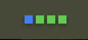

# Railway HUD

Native macOS menu bar app for Railway service status.



## What it does

- Shows one LED per service in the menu bar
- Opens a service panel on click
- Opens the selected service in Railway
- Lets you reorder services
- Polls every 30 seconds

## LED colors

| Color | Meaning |
| --- | --- |
| Green | Success |
| Blue | Deploying |
| Yellow | Queued |
| Red | Failed / disconnected |
| Gray | Unknown / empty |

## Requirements

- macOS 13+
- Railway account

## Install

Download `RailwayHUD.zip` from the [latest release](https://github.com/cdinic/railway_hud/releases/latest), unzip it, then open `RailwayHUD.app`.

Unsigned app on first launch: right-click the app, choose **Open**, then confirm.

## Build

```bash
git clone https://github.com/cdinic/railway_hud.git
cd railway_hud
./build.sh
open RailwayHUD.app
```

## Connect

Open the HUD, choose `settings`, sign in with Railway, then select a project and save it.

Tokens are stored in the macOS Keychain. The selected project ID is stored in `UserDefaults`.

## OAuth setup for source builds

1. Create a Railway OAuth app.
2. Set the redirect URI to `com.local.railway-hud://oauth/callback`.
3. Put your client ID in [Sources/RailwayHUD/OAuthManager.swift](/Users/chrisdinicolas/Documents/Railway%20HUD/Sources/RailwayHUD/OAuthManager.swift).
4. Rebuild with `./build.sh`.
